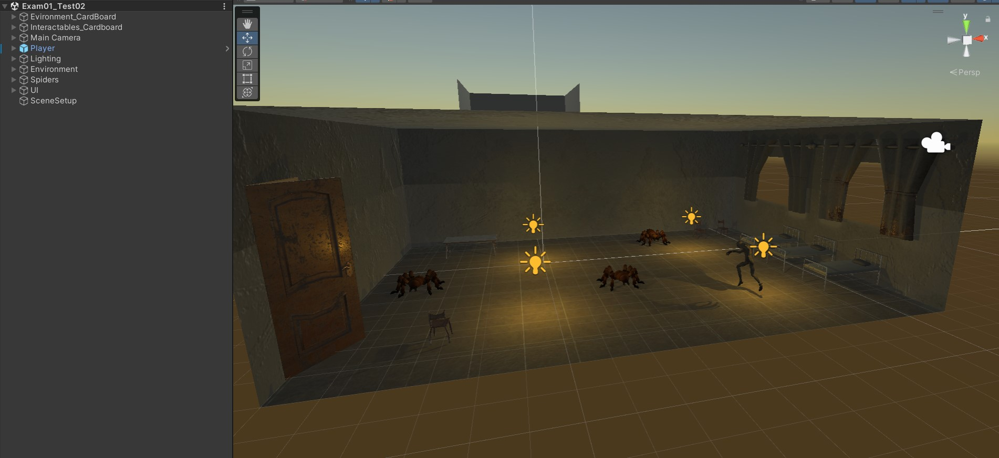

# Interfaces Inteligentes - Examen 01: Prueba VR  

- Autor: Thomas Edward Bradley  
- Fecha: 07/11/23  

## Resumen  
Primera prueba de la asignatura basado en realizar varias transformaciones de posición para 
demostrar un control adecuado de las funcionalidades básicas de unity, programación basado en eventos, 
trabajo con canvas y la posterior integración de funcionalidades de cardboard. Todo lo descrito a continuación 
sera en referencia a la segunda entrega ya que mucha cambia de la primera a ella, como por ejemplo la escena primaria. 
Siendo esta 'Scenes/Exam01_Test02' en la segunda entrega (empece organizando ls escana de 0 para tener más control sobre ella). 
Esto es debido a lo poco que conseguí desarrollar la primera semana y la poca optimización de esta.  

## Tarea 01  
  
***Scripts:*** -  
  
No hay mucho que comentar, se tienen que agregar los paquetes en la unity asset store y posteriormente importarlas 
a nuestro repositorio. Dicho esto, dentro de nuestra escena tengo las arañas agrupadas por un empty, el ghoul llamado Player,
quite la luz de punto que viene por defecto y modifique los parámetros de la luz global para alinear estas con los parámetros 
de la demoScene perteneciente al Horror Asset Pack (también agrupe las luces internas dentro de un empty llamado Lighting), todas 
las props (sillas, mesas, ...) como la propia habitación fueron agrupados en un empty llamado Environment. También cabe mencionar que movi la camara a la esquina de la habitación. Para ver los assets que utilice y sus posiciones iniciales, puede observar la imagen incluida por arriba.  
  
*Lo acabado en '_Cardboard' fue de la escena Cardboard original  

## Tarea 02  
   
***Scripts:*** ghoulMovement.cs  
  
El movimiento de este esta basado en la que tenia la esfera en una practica previa, al estilo de movimiento como tanque (rotando el personaje con A, D), por lo que no voy a comentar mucho al respecto. Dicho esto, para saltar hace falta agregarle un collider (tiene por defecto pero hay que modificarlo para mejor ajustarse a lo que necesitemos) y un rigidbody (al cual congelaremos la rotacion en los ejes Z, X para que no se pueda caer). Ahora en nuestro script verificamos si esta colisionando con un objeto con tag 'Ground' y si es el caso, le habilitamos el salto. Si pulsamos Espacio se impulsara al jugador hacia arriba y se le quitara la opción de saltar hasta que vuelva a colisionar con 'Ground' (altura determinado por jumpHeight). 

## Tarea 03
  
***Scripts:*** spiderCollision.cs  
  
El script se agrego sobre el propio jugador, en cuanto a las arañas les puse un collider rectangular que ocupa lo visible del mesh renderer y un trigger cilindrico en el medio. De este modo podemos detectar cuando el jugador salta encima de estas y omitir que pase cuando interactua con ellos por uno de los laterales. También inclui un canvas nuevo (llamado UI) y le agregue texto (con fuente proveniente de la Unity Asset Store), el cual utilizamos en nuestro script. Dentro de la misma detectamos si se ha collisionado con un trigger de un objeto con tag "Spider", y si es el caso sumamos 10 a un contador, pasandole este valor a nuestro texto.  

## Tarea 04
  
***Scripts:*** moveSpider01.cs, moveSpider02.cs & moveSpider03.cs  
  
Para la araña A usamos el primer script, el cual verifica mediante un bool toChair hacia que objeto moverse. Esta se deshabilita si se colisiona con el tag "Table" y se vuelve a habailitar cuando choca contra el tag "Chair". El propio movimiento se hace con un Translate hacia delante despues de un LookAt (velocidad determinada por speed).  
  
La araña B aplica este mismo principio (bool moveA) pero cambia de uno al otro en base a si su posicion coincide con su destino, no a traves de colisiones. Los puntos son generados aleatoriamente (con Random.Range) dentro del espacio disponible para la araña y omitiendo el eje Y. El movimiento se calcula con MoveTowards (determinando su velocidad con moveSpeed).  
  
Hacemos saltar la araña C del mismo modo que nuestro jugador pero quitando la condición de pulsar la tecla espacio, por lo que directamente hace el salto cuando colisiona con un objeto con el tag 'Ground' (con altura determinado por jumpHeight).  
  
*Todos los cambios de posición sin usar rigidbodies son multiplicados por Time.deltaTime

## Tarea 05
  
***Scripts:*** bedCollision.cs, moveBed.cs & jumpChair.cs  
  
E

## Tarea 06
***Scripts:*** -  
  
Partí del mismo proyecto utlizado para nuestras escenas cardboard de practica por lo que ya tenia el 
proyecto configurado adecuadamente. Tambien cambie la camara de nuestra escena por la que tiene reticulo y 
las funcionalidades que nos permite esta. Ademas agregue un objeto 'Scene Setup' al que le agregue el script 
para inicializar las funcionalidades del cardboard.  

## Tarea 07
  
***Scripts:*** spiderGaze.cs & cameraMovement.cs  
  
E

## Modificacion
  
***Scripts:*** gazeSpiderA.cs, growSpiderB.cs & teleportToBed.cs  
  
E